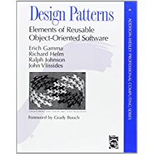

#### Design Pattern Playgrounds

The Gang of Four ( GoF ) book on Design Patterns

 
[Design Patterns - Elements of Reusable Object-Oriented Software by Erich Gamma, Richard Helm, Ralph Johnson and John Vlissades](https://www.amazon.com/Design-Patterns-Elements-Reusable-Object-Oriented/dp/0201633612/ref=sr_1_1?ie=UTF8&qid=1495454583&sr=8-1&keywords=design+patterns+elements+of+reusable+object-oriented+software) 

fundamentally changed the way we think about software architecture, software development and OO design. These playgrounds take one or two design patterns and show how to implement and use them. I have tried to demonstrate them in ways that are different from the book to show that they are widely applicable.

The first playground Decorator.playground demonstrates a naive use of the Decorator pattern. In this case it shows how a BorderedView can be reused whereas a custom BorderedTextField can not. Obvsiously this is not how one would border a UITextField, but it demonstrates the concept.

The second playground is a more sophisticated use of Decorator in conjunction with Strategy pattern. Currently I have not documented playgrounds themselves, but I will be doing so and adding playgrounds over the next couple of months.